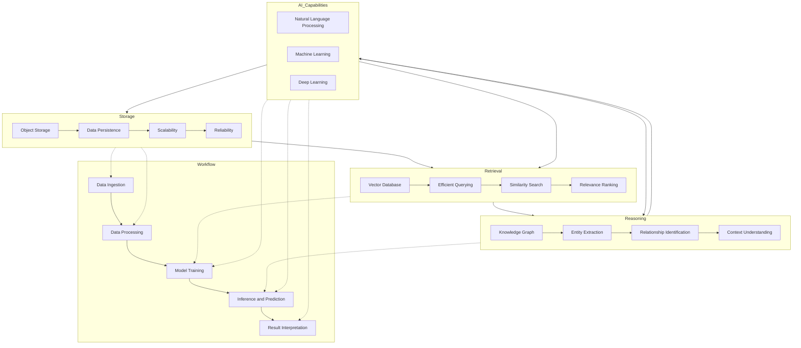
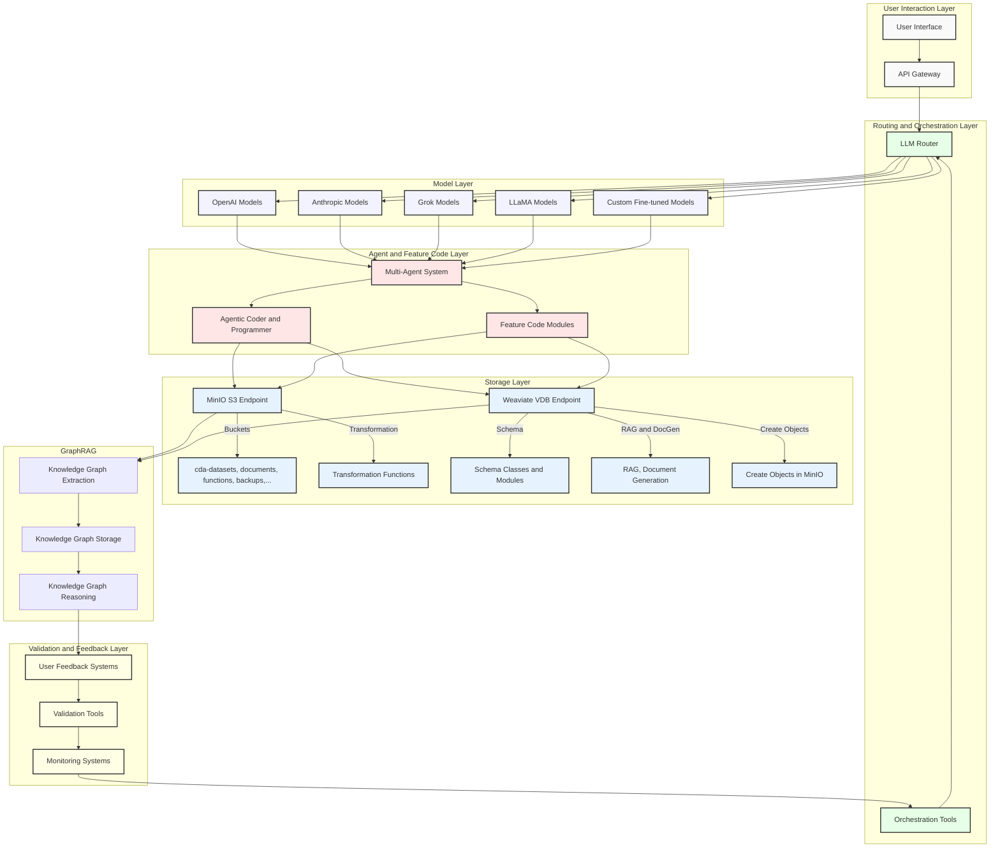

# Architecting AI: Unifying Storage, Retrieval, and Reasoning

Here's a full archetype diagram and flow chart of the AI-driven architecture using Mermaid:



This diagram represents the key components and their interactions in the AI-driven architecture:

1. Storage:
   - Object Storage: Provides data persistence.
   - Scalability: Ensures the storage can handle growing data volumes.
   - Reliability: Guarantees data durability and availability.

2. Retrieval:
   - Vector Database: Enables efficient querying of data.
   - Efficient Querying: Allows for fast and accurate data retrieval.
   - Similarity Search: Facilitates finding similar or related data points.
   - Relevance Ranking: Prioritizes search results based on relevance to the query.

3. Reasoning:
   - Knowledge Graph: Represents entities and their relationships.
   - Entity Extraction: Identifies and extracts entities from unstructured data.
   - Relationship Identification: Discovers connections between entities.
   - Context Understanding: Captures the contextual meaning of data.

4. AI Capabilities:
   - Natural Language Processing: Enables understanding and generation of human language.
   - Machine Learning: Allows the system to learn and improve from data.
   - Deep Learning: Facilitates complex pattern recognition and representation learning.

The workflow of the architecture follows these steps:
1. Data Ingestion: Collecting and importing data into the system.
2. Data Processing: Cleaning, transforming, and preparing data for analysis.
3. Model Training: Building and training AI models using the processed data.
4. Inference and Prediction: Applying trained models to make predictions or generate insights.
5. Result Interpretation: Analyzing and deriving meaningful conclusions from the model outputs.

The dashed lines indicate the interactions between the main components (Storage, Retrieval, Reasoning) and the workflow steps, showcasing how data flows and is processed within the architecture.

This diagram provides a high-level overview of the AI-driven architecture, highlighting the key components, their relationships, and the overall workflow.​​​​​​​​​​​​​​​​

Here's a unified architecture that incorporates the key components and concepts from the provided sections:



This architecture unifies the components and concepts discussed in the provided sections:

1. **User Interaction Layer**: Includes the user interface and API gateway for handling user requests.

2. **Routing and Orchestration Layer**: Consists of the LLM router (e.g., Cdaprod/RouteLLM) and orchestration tools (e.g., Autogen, Langgraph, LangChain) for directing requests to appropriate models and managing the multi-agent system.

3. **Model Layer**: Contains various language models from OpenAI, Anthropic, Grok, LLaMA, and custom fine-tuned models.

4. **Agent and Feature Code Layer**: Includes the multi-agent system, agentic coder and programmer, and feature code modules for executing tasks and generating code.

5. **Storage Layer**: Consists of MinIO for object storage (with buckets for datasets, documents, functions, backups, etc.) and Weaviate for the vector database (with schema classes, modules, RAG, document generation, and object creation in MinIO).

6. **GraphRAG Integration**: Incorporates GraphRAG for knowledge graph extraction, storage, and reasoning, enhancing the retrieval and generation capabilities.

7. **Validation and Feedback Layer**: Includes user feedback systems, validation tools, and monitoring systems for ensuring the quality and performance of the system.

The data flow follows the arrows, starting from user interactions and moving through the layers for processing, storage, and feedback.

This architecture provides a comprehensive and scalable solution for integrating various AI components, including MinIO, Weaviate, and GraphRAG, to enable dynamic ETL operations, document generation, and advanced querying capabilities.​​​​​​​​​​​​​​​​

## Building the Codebase

Here's a unified Python script that combines the code blocks and provides a low-level interface for interacting with the MinIO object store, Weaviate vector database, and GraphRAG:

```python
import os
from minio import Minio
from weaviate import Client as WeaviateClient
from openai import OpenAI
from langchain import PromptTemplate, LLMChain
from graph_rag import GraphRAG

class ETLPipeline:
    def __init__(self, minio_endpoint, minio_access_key, minio_secret_key, weaviate_endpoint, openai_api_key):
        self.minio_client = Minio(minio_endpoint, access_key=minio_access_key, secret_key=minio_secret_key, secure=False)
        self.weaviate_client = WeaviateClient(weaviate_endpoint)
        self.openai_client = OpenAI(api_key=openai_api_key)
        self.graphrag = GraphRAG()

    def load_objects_from_minio(self, bucket_name):
        objects = self.minio_client.list_objects(bucket_name)
        data = []
        for obj in objects:
            response = self.minio_client.get_object(bucket_name, obj.object_name)
            data.append(response.read())
        return data

    def process_documents_with_graphrag(self, documents):
        temp_dir = './temp_docs'
        os.makedirs(temp_dir, exist_ok=True)

        for idx, doc in enumerate(documents):
            with open(os.path.join(temp_dir, f'doc_{idx}.txt'), 'wb') as file:
                file.write(doc)

        self.graphrag.index_documents(temp_dir)

    def query_weaviate(self, query):
        results = self.weaviate_client.query.get('Document', ['text', 'source']).with_filter({
            "path": ["text"],
            "operator": "Like",
            "valueText": query
        }).do()
        return results['data']['Get']['Document']

    def generate_document(self, query, template):
        sources = self.query_weaviate(query)
        source_texts = "\n".join([f"{source['text']} (Source: {source['source']})" for source in sources])
        prompt = PromptTemplate(template=template, input_variables=['query', 'sources'])
        llm_chain = LLMChain(llm=self.openai_client, prompt=prompt)
        document = llm_chain.run(query=query, sources=source_texts)
        return document

# Example usage
if __name__ == "__main__":
    minio_endpoint = 'http://rpi5-1:9001'
    minio_access_key = 'YOUR_ACCESS_KEY'
    minio_secret_key = 'YOUR_SECRET_KEY'
    weaviate_endpoint = 'http://rpi5-1:8080'
    openai_api_key = 'YOUR_API_KEY'

    pipeline = ETLPipeline(minio_endpoint, minio_access_key, minio_secret_key, weaviate_endpoint, openai_api_key)

    bucket_name = 'cda-datasets'
    documents = pipeline.load_objects_from_minio(bucket_name)
    pipeline.process_documents_with_graphrag(documents)

    query = "What are the impacts of AI in healthcare?"
    template = "Generate a detailed report based on the following query and data sources:\nQuery: {query}\nSources: {sources}"
    report = pipeline.generate_document(query, template)
    print(report)
```

This script provides a low-level interface through the `ETLPipeline` class, which encapsulates the interactions with MinIO, Weaviate, OpenAI, and GraphRAG. The main functionalities include:

1. Loading objects from a MinIO bucket (`load_objects_from_minio`).
2. Processing documents using GraphRAG (`process_documents_with_graphrag`).
3. Querying Weaviate for relevant documents (`query_weaviate`).
4. Generating a document based on a query and a template (`generate_document`).

The script demonstrates an example usage of the `ETLPipeline` class, where it loads objects from a MinIO bucket, processes them with GraphRAG, and generates a detailed report based on a query and a template.

Note: Make sure to replace the placeholders (`YOUR_ACCESS_KEY`, `YOUR_SECRET_KEY`, `YOUR_API_KEY`) with your actual credentials and adjust the endpoint URLs if necessary.​​​​​​​​​​​​​​​​

## Abstracted

Here's the updated Python script using abstract base classes (ABC) to provide a low-level interface for interacting with the MinIO object store, Weaviate vector database, and GraphRAG:

```python
import os
from abc import ABC, abstractmethod
from minio import Minio
from weaviate import Client as WeaviateClient
from openai import OpenAI
from langchain import PromptTemplate, LLMChain
from graph_rag import GraphRAG

class StorageClient(ABC):
    @abstractmethod
    def load_objects(self, bucket_name):
        pass

class VectorDatabaseClient(ABC):
    @abstractmethod
    def query(self, query):
        pass

class LanguageModel(ABC):
    @abstractmethod
    def generate_document(self, query, template):
        pass

class MinIOClient(StorageClient):
    def __init__(self, endpoint, access_key, secret_key):
        self.client = Minio(endpoint, access_key=access_key, secret_key=secret_key, secure=False)

    def load_objects(self, bucket_name):
        objects = self.client.list_objects(bucket_name)
        data = []
        for obj in objects:
            response = self.client.get_object(bucket_name, obj.object_name)
            data.append(response.read())
        return data

class WeaviateClient(VectorDatabaseClient):
    def __init__(self, endpoint):
        self.client = WeaviateClient(endpoint)

    def query(self, query):
        results = self.client.query.get('Document', ['text', 'source']).with_filter({
            "path": ["text"],
            "operator": "Like",
            "valueText": query
        }).do()
        return results['data']['Get']['Document']

class OpenAILanguageModel(LanguageModel):
    def __init__(self, api_key):
        self.client = OpenAI(api_key=api_key)

    def generate_document(self, query, template, sources):
        source_texts = "\n".join([f"{source['text']} (Source: {source['source']})" for source in sources])
        prompt = PromptTemplate(template=template, input_variables=['query', 'sources'])
        llm_chain = LLMChain(llm=self.client, prompt=prompt)
        document = llm_chain.run(query=query, sources=source_texts)
        return document

class ETLPipeline:
    def __init__(self, storage_client, vector_db_client, language_model):
        self.storage_client = storage_client
        self.vector_db_client = vector_db_client
        self.language_model = language_model
        self.graphrag = GraphRAG()

    def process_documents_with_graphrag(self, documents):
        temp_dir = './temp_docs'
        os.makedirs(temp_dir, exist_ok=True)

        for idx, doc in enumerate(documents):
            with open(os.path.join(temp_dir, f'doc_{idx}.txt'), 'wb') as file:
                file.write(doc)

        self.graphrag.index_documents(temp_dir)

    def generate_report(self, query, template):
        documents = self.storage_client.load_objects('cda-datasets')
        self.process_documents_with_graphrag(documents)
        sources = self.vector_db_client.query(query)
        report = self.language_model.generate_document(query, template, sources)
        return report

# Example usage
if __name__ == "__main__":
    minio_client = MinIOClient('http://rpi5-1:9001', 'YOUR_ACCESS_KEY', 'YOUR_SECRET_KEY')
    weaviate_client = WeaviateClient('http://rpi5-1:8080')
    openai_model = OpenAILanguageModel('YOUR_API_KEY')

    pipeline = ETLPipeline(minio_client, weaviate_client, openai_model)

    query = "What are the impacts of AI in healthcare?"
    template = "Generate a detailed report based on the following query and data sources:\nQuery: {query}\nSources: {sources}"
    report = pipeline.generate_report(query, template)
    print(report)
```

In this updated version, we define abstract base classes (`StorageClient`, `VectorDatabaseClient`, `LanguageModel`) to provide a common interface for interacting with different components of the ETL pipeline. The concrete implementations (`MinIOClient`, `WeaviateClient`, `OpenAILanguageModel`) inherit from these abstract base classes and provide the actual functionality.

The `ETLPipeline` class now takes instances of `StorageClient`, `VectorDatabaseClient`, and `LanguageModel` as parameters, allowing for flexibility and modularity in the pipeline construction.

The main workflow remains the same:
1. Load objects from MinIO using the `StorageClient`.
2. Process documents with GraphRAG.
3. Query Weaviate for relevant sources using the `VectorDatabaseClient`.
4. Generate a report using the `LanguageModel`.

The example usage demonstrates how to create instances of the concrete classes (`MinIOClient`, `WeaviateClient`, `OpenAILanguageModel`) and pass them to the `ETLPipeline` constructor. The pipeline then generates a report based on a given query and template.

This abstract base class approach allows for easier extensibility and interchangeability of components in the ETL pipeline.​​​​​​​​​​​​​​​​