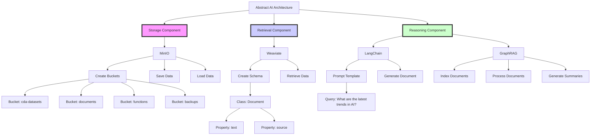

# Architecting AI: Storage, Retrieval, and Reasoning

This is a detailed Mermaid diagram representing the abstracted AI architecture using MinIO for storage, Weaviate for retrieval, and a reasoning engine with LangChain and GraphRAG:



This diagram visually represents the key components and their interactions within the AI architecture discussed throughout the article:

- **Storage Component**:
  - MinIO is used for object storage.
  - Buckets are created for organizing data.
  - Functions for saving and loading data are implemented.

- **Retrieval Component**:
  - Weaviate is used for vector-based search.
  - A schema is created to manage documents.
  - Functions for data retrieval are implemented.

- **Reasoning Component**:
  - LangChain is used for prompt engineering.
  - GraphRAG is used for enhanced retrieval-augmented generation.
  - Functions for indexing, processing, and summarizing documents are implemented.

#### Introduction

The field of artificial intelligence (AI) is growing at an unprecedented rate, with companies across various industries eager to implement AI solutions. However, many organizations struggle with understanding how to integrate the different components necessary for a robust AI system. This blog post aims to demystify AI architecting by focusing on three fundamental aspects: storage, retrieval, and reasoning. These elements are analogous to the exposure triangle in photography--aperture, shutter speed, and ISO--that work together to create a well-exposed image.

#### The Exposure Triangle of AI

Just as a photographer must balance aperture, shutter speed, and ISO to capture a perfect image, an AI system must effectively manage storage, retrieval, and reasoning to deliver optimal performance. Each component plays a crucial role in the overall functionality of the AI system.

##### Storage: The Aperture of AI

In photography, the aperture controls the amount of light entering the camera, influencing depth of field and overall exposure. Similarly, in AI, storage refers to how data is stored and organized. Efficient storage systems ensure that data is easily accessible and can be utilized effectively.

- **MinIO for Object Storage**: MinIO is a high-performance, scalable object storage system compatible with the S3 API. It provides a robust solution for storing large datasets, ensuring data is organized and accessible.
- **Data Organization**: Proper data organization is critical. Creating structured schemas and categorizing data into buckets can significantly improve data management and retrieval processes.

##### Retrieval: The Shutter Speed of AI

Shutter speed in photography determines the duration of light exposure, affecting motion blur and image clarity. In AI, retrieval involves accessing and extracting relevant information from stored data, impacting the speed and efficiency of the system.

- **Weaviate for Vector-Based Search**: Weaviate is an open-source vector search engine that uses machine learning models for semantic search. It allows AI systems to retrieve relevant information quickly and accurately.
- **Integration with MinIO**: Combining MinIO for storage and Weaviate for retrieval creates a powerful infrastructure. Data stored in MinIO can be indexed and queried through Weaviate, enabling efficient data retrieval and utilization.

##### Reasoning: The ISO of AI

ISO in photography adjusts the camera sensor's sensitivity to light, affecting the brightness and graininess of the image. In AI, reasoning refers to using retrieved information to make decisions, draw conclusions, and generate outputs.

- **LangChain for Prompt Engineering**: LangChain provides tools to create and manage prompts, facilitating consistent and reusable query patterns. This enhances the AI's ability to generate accurate and contextually relevant responses.
- **GraphRAG for Enhanced Retrieval-Augmented Generation (RAG)**: GraphRAG combines knowledge graphs with RAG to improve document generation and query responses. It leverages stored knowledge and real-time web data to produce detailed, context-rich outputs.

#### Implementing the AI Architecture

Let's explore how to implement this architecture in a real-world scenario, focusing on how these components intertwine and enhance each other.

##### 1. Setting Up MinIO for Storage

MinIO provides a reliable storage solution for your data. By creating organized buckets, you can ensure that data is easily accessible for retrieval and processing.

##### 2. Using Weaviate for Efficient Retrieval

Weaviate allows you to index and search your data effectively. Integrating Weaviate with MinIO ensures that stored data can be quickly retrieved and used for various AI applications.

##### 3. Leveraging LangChain and GraphRAG for Reasoning

By using LangChain and GraphRAG, you can enhance the reasoning capabilities of your AI system. LangChain helps manage and format prompts, while GraphRAG uses knowledge graphs to provide detailed, contextually accurate responses.

##### Summarized Analysis

Building an AI system is not a one-size-fits-all endeavor. It requires a deep understanding of how to integrate different components to achieve optimal performance. By focusing on storage, retrieval, and reasoning, you can create a robust AI infrastructure capable of delivering high-quality results. This approach ensures that your AI system is well-balanced and capable of handling the complexities of modern data-driven applications.

### References

1. [MinIO Python SDK Documentation](https://docs.min.io/docs/python-client-api-reference.html)
2. [Weaviate Python Client Documentation](https://weaviate.io/developers/weaviate/current/client-libraries/python.html)
3. [GraphRAG Documentation](https://microsoft.github.io/graphrag/)
4. [LangChain Documentation](https://towardsai.net/p/machine-learning/langchain-develop-llm-powered-applications-using-langchain)
5. [OpenAI API Documentation](https://platform.openai.com/docs/api-reference/introduction)

By leveraging these powerful tools and technologies, you can build an AI system that not only stores and retrieves data efficiently but also reasons over it to generate meaningful insights and outputs.

## Architecting AI: Building the Example 

### Introduction

Building an AI system from the ground up involves integrating multiple layers and components to ensure seamless operation. This post will delve into three critical aspects of AI architecting: storage, retrieval, and reasoning. We'll explore how to set up robust data storage with MinIO, enhance retrieval processes using Weaviate, and leverage the capabilities of LangChain and GraphRAG for sophisticated reasoning and document generation.

### 1. Storage: MinIO for Object Storage

**MinIO** is a high-performance object storage system that is compatible with the S3 API, making it a perfect choice for scalable and reliable data storage.

#### Setting Up MinIO
MinIO can be easily deployed on your local server. For this setup, assume MinIO is running on `http://rpi5-1:9001`.

1. **Installation**: Install MinIO on your server and configure it.
2. **Bucket Creation**: Create buckets to organize your data.

```python
from minio import Minio

# Initialize the MinIO client
minio_client = Minio(
    "localhost:9001",
    access_key="YOUR_ACCESS_KEY",
    secret_key="YOUR_SECRET_KEY",
    secure=False
)

# Function to create buckets
def create_buckets(bucket_names):
    for bucket_name in bucket_names:
        if not minio_client.bucket_exists(bucket_name):
            minio_client.make_bucket(bucket_name)

# Example bucket names
bucket_names = ["cda-datasets", "documents", "functions", "backups"]
create_buckets(bucket_names)
```

MinIO will handle the storage of all generated and processed data, ensuring it is organized and easily accessible.

### 2. Retrieval: Weaviate for Vector-Based Search

**Weaviate** is an open-source vector search engine that allows you to store and search through data using machine learning models. It is especially useful for applications requiring semantic search and knowledge graph management.

#### Setting Up Weaviate
Assume Weaviate is running on `http://rpi5-1:8080`.

1. **Installation**: Install Weaviate and configure it for your environment.
2. **Schema Definition**: Define schemas to manage your data.

```python
import weaviate

# Initialize Weaviate client
weaviate_client = weaviate.Client("http://localhost:8080")

# Define schema for documents
def create_schema():
    class_obj = {
        "class": "Document",
        "description": "A document from MinIO",
        "properties": [
            {"name": "text", "dataType": ["text"]},
            {"name": "source", "dataType": ["string"]}
        ]
    }
    weaviate_client.schema.create_class(class_obj)

create_schema()
```

#### Integrating MinIO and Weaviate
Load documents from MinIO and index them in Weaviate for efficient retrieval.

```python
from minio import Minio
import weaviate

# Initialize MinIO and Weaviate clients
minio_client = Minio('http://rpi5-1:9001', access_key='YOUR_ACCESS_KEY', secret_key='YOUR_SECRET_KEY', secure=False)
weaviate_client = weaviate.Client("http://rpi5-1:8080")

# Function to load and index documents
def load_and_index_documents(bucket_name):
    objects = minio_client.list_objects(bucket_name)
    for obj in objects:
        response = minio_client.get_object(bucket_name, obj.object_name)
        text = response.read().decode("utf-8")
        data_object = {
            "text": text,
            "source": obj.object_name
        }
        weaviate_client.data_object.create(data_object, "Document")

load_and_index_documents("documents")
```

### 3. Reasoning: Leveraging LangChain and GraphRAG

For reasoning and advanced document generation, we use **LangChain** and **GraphRAG**. These tools facilitate the development of applications that can generate detailed, context-rich documents by querying both stored knowledge and real-time web data.

#### LangChain for Prompt Engineering
LangChain provides utilities to create and manage prompts, enabling consistent and reusable query patterns.

```python
from langchain import PromptTemplate, LLMChain
from openai import OpenAI

# Initialize OpenAI client
openai_client = OpenAI(api_key='YOUR_API_KEY')

# Define a prompt template
template = "Generate a detailed report based on the following query and data sources:\nQuery: {query}\nSources: {sources}"

prompt = PromptTemplate(template=template, input_variables=['query', 'sources'])

# Generate a document using LangChain and OpenAI
def generate_document(query):
    sources = query_weaviate(query)
    source_texts = "\n".join([f"{source['text']} (Source: {source['source']})" for source in sources])
    llm_chain = LLMChain(llm=openai_client, prompt=prompt)
    document = llm_chain.run(query=query, sources=source_texts)
    return document

# Example query
query = "What are the latest trends in AI?"
document = generate_document(query)
print(document)
```

#### GraphRAG for Enhanced RAG
**GraphRAG** combines knowledge graphs with retrieval-augmented generation to enhance document generation and query response accuracy.

```python
import os
from graph_rag import GraphRAG

# Save documents to a temporary directory
temp_dir = './temp_docs'
os.makedirs(temp_dir, exist_ok=True)

for idx, doc in enumerate(documents):
    with open(os.path.join(temp_dir, f'doc_{idx}.txt'), 'wb') as file:
        file.write(doc)

# Initialize GraphRAG
graphrag = GraphRAG()
graphrag.index_documents(temp_dir)

# Use GraphRAG to process and summarize documents
def process_with_graphrag():
    graphrag.process_documents(temp_dir)
    summaries = graphrag.generate_summaries()
    return summaries

summaries = process_with_graphrag()
print(summaries)
```

#### Summarized Analysis

Integrating MinIO, Weaviate, LangChain, and GraphRAG provides a powerful and scalable framework for AI applications. This architecture allows for efficient data storage, robust retrieval mechanisms, and sophisticated reasoning capabilities. By combining these technologies, you can build AI systems capable of generating detailed, contextually enriched documents and responding accurately to complex queries.

This comprehensive approach ensures your AI system is well-architected to handle the demands of modern applications, leveraging the best tools and techniques available.

### References

1. [MinIO Python SDK Documentation](https://docs.min.io/docs/python-client-api-reference.html)
2. [Weaviate Python Client Documentation](https://weaviate.io/developers/weaviate/current/client-libraries/python.html)
3. [GraphRAG Documentation](https://microsoft.github.io/graphrag/)
4. [LangChain Documentation](https://towardsai.net/p/machine-learning/langchain-develop-llm-powered-applications-using-langchain)
5. [OpenAI API Documentation](https://platform.openai.com/docs/api-reference/introduction)

By following this detailed guide, you can build and deploy an AI system that efficiently stores, retrieves, and reasons over data, ensuring robust and scalable performance.

## Architecting AI: An Advanced Example of Entity Recognition with ChatGPT Integration

To integrate GraphRAG with your existing architecture using MinIO and Weaviate, you can follow these steps. This process will involve setting up your data pipeline to leverage MinIO for storage and Weaviate for vector-based search and knowledge graph management, while utilizing the GraphRAG capabilities for query-focused summarization and enhanced information retrieval.

### Setup Overview

1. **MinIO for Storage**: MinIO will be used to store your data objects and files.
2. **Weaviate for Vector Storage**: Weaviate will manage your vector database and handle schema classes for metadata and entity relationships.
3. **GraphRAG Integration**: GraphRAG will be used to process queries, extract entities and relationships, and utilize hierarchical community detection.

### Steps to Implement

#### 1. Set Up MinIO and Weaviate

**MinIO Setup**:
- Ensure MinIO is running and accessible at your endpoint (e.g., `http://rpi5-1:9001`).
- Use the MinIO Python SDK to interact with MinIO buckets.

**Weaviate Setup**:
- Ensure Weaviate is running and accessible at your endpoint (e.g., `http://rpi5-1:8080`).
- Use the Weaviate Python client to interact with the vector database and manage schema classes.

#### 2. Create Buckets and Schemas

**MinIO Buckets**:
- Create buckets such as `cda-datasets`, `documents`, `functions`, etc., to organize your data.
- Example using MinIO Python SDK:
  ```python
  from minio import Minio
  from minio.error import S3Error

  minio_client = Minio(
      "localhost:9001",
      access_key="minioadmin",
      secret_key="minioadmin",
      secure=False
  )

  buckets = ["cda-datasets", "documents", "functions", "backups", "cached-memory", "raw-data", "structured-data", "generated-udata", "images", "videos", "misc"]

  for bucket in buckets:
      try:
          minio_client.make_bucket(bucket)
      except S3Error as err:
          print(err)
  ```

**Weaviate Schemas**:
- Define schema classes for entities and relationships.
- Example using Weaviate Python client:
  ```python
  import weaviate

  client = weaviate.Client("http://localhost:8080")

  # Define a schema for an entity
  class_obj = {
      "class": "Entity",
      "description": "An entity extracted from documents",
      "properties": [
          {
              "name": "name",
              "dataType": ["string"]
          },
          {
              "name": "description",
              "dataType": ["text"]
          },
          {
              "name": "vector",
              "dataType": ["number[]"]
          }
      ]
  }

  client.schema.create_class(class_obj)
  ```

#### 3. Integrate GraphRAG

**GraphRAG Data Processing**:
- Use GraphRAG to process data stored in MinIO, extract entities, and store them in Weaviate.
- Ensure your environment is set up for GraphRAG:
  ```bash
  python -m graphrag.index --init --root ./ragtest
  ```

**Entity and Relationship Extraction**:
- Use GraphRAG’s capabilities to extract entities and relationships from text documents stored in MinIO.

**Hierarchical Community Detection**:
- Detect communities and organize them hierarchically to improve query-focused summarization.

#### 4. Implement Query Handling

**Query Processing with OpenAI**:
- Use OpenAI's API to define functions for querying your data and retrieving relevant information.

**Example OpenAI Function Call**:
```python
import openai

openai.api_key = 'your_openai_api_key'

functions = [
    {
        "name": "retrieve_entities",
        "description": "Retrieve entities based on a query",
        "parameters": {
            "type": "object",
            "properties": {
                "query": {"type": "string"}
            },
            "required": ["query"]
        }
    }
]

response = openai.ChatCompletion.create(
    model="gpt-4-0613",
    messages=[
        {"role": "system", "content": "You are an assistant that can call functions."},
        {"role": "user", "content": "Retrieve entities related to space exploration."}
    ],
    functions=functions,
    function_call="auto"
)

print(response)
```

### Practical Example

1. **Upload Data to MinIO**:
   ```python
   from minio import Minio
   from minio.error import S3Error

   minio_client = Minio(
       "localhost:9001",
       access_key="minioadmin",
       secret_key="minioadmin",
       secure=False
   )

   # Upload a document
   minio_client.fput_object(
       "documents", "space_exploration.txt", "/path/to/space_exploration.txt"
   )
   ```

2. **Extract and Store Entities in Weaviate**:
   ```python
   import weaviate

   client = weaviate.Client("http://localhost:8080")

   # Example entity extraction
   entity = {
       "name": "Elon Musk",
       "description": "CEO of SpaceX",
       "vector": [0.1, 0.2, 0.3]  # Example vector
   }

   client.data_object.create(entity, "Entity")
   ```

3. **Handle User Queries**:
   - Use OpenAI’s function calling to process user queries, retrieve relevant entities, and provide contextually enriched responses.

By following these steps, you can effectively integrate GraphRAG with your MinIO and Weaviate setup, leveraging the strengths of each component to enhance your AI architecture. This approach will enable you to perform complex ETL operations, query your data efficiently, and generate meaningful, contextually accurate responses.

## Architecting AI: Advanced Example of Custom Functionality with ChatGPT Integration

To create an advanced implementation where MinIO bucket objects are listed and can be input either individually or as a collection for modeling and querying, you will need to integrate the functionalities of MinIO, Weaviate, and GraphRAG. This setup will enable dynamic and sophisticated data management and retrieval.

### Advanced Setup Steps

1. **List MinIO Bucket Objects**: Use the MinIO Python SDK to list objects in a specified bucket.

2. **Model Objects**: Each object in MinIO can be processed individually or collectively to extract entities and relationships, which will be stored in Weaviate.

3. **Integrate with GraphRAG**: Use GraphRAG to enhance the RAG capabilities by processing queries, extracting relevant information, and providing enriched responses.

4. **Implement OpenAI Function Calling**: Enable querying capabilities using OpenAI's API to interact with the system dynamically.

#### 1. List MinIO Bucket Objects

```python
from minio import Minio

# Initialize the MinIO client
minio_client = Minio(
    "localhost:9001",
    access_key="minioadmin",
    secret_key="minioadmin",
    secure=False
)

# Function to list objects in a bucket
def list_objects(bucket_name):
    objects = minio_client.list_objects(bucket_name)
    return [obj.object_name for obj in objects]

# Example usage
bucket_name = "documents"
object_list = list_objects(bucket_name)
print(object_list)
```

#### 2. Process and Model Objects

For each object listed, extract and store entities and relationships in Weaviate.

```python
import weaviate
import json

# Initialize Weaviate client
weaviate_client = weaviate.Client("http://localhost:8080")

# Define schema for entities
def create_schema():
    class_obj = {
        "class": "Entity",
        "description": "An entity extracted from documents",
        "properties": [
            {"name": "name", "dataType": ["string"]},
            {"name": "description", "dataType": ["text"]},
            {"name": "vector", "dataType": ["number[]"]}
        ]
    }
    weaviate_client.schema.create_class(class_obj)

# Extract entities from object content
def extract_entities(object_content):
    # Use an NLP model (e.g., OpenAI GPT-4) to extract entities
    # This is a placeholder for actual entity extraction logic
    entities = [
        {"name": "Elon Musk", "description": "CEO of SpaceX", "vector": [0.1, 0.2, 0.3]}
    ]
    return entities

# Store entities in Weaviate
def store_entities(entities):
    for entity in entities:
        weaviate_client.data_object.create(entity, "Entity")

# Example processing function
def process_objects(bucket_name):
    object_list = list_objects(bucket_name)
    for object_name in object_list:
        object_content = minio_client.get_object(bucket_name, object_name).read().decode("utf-8")
        entities = extract_entities(object_content)
        store_entities(entities)

# Create schema and process objects
create_schema()
process_objects("documents")
```

#### 3. Integrate GraphRAG

Configure GraphRAG to use the extracted entities and relationships for enhanced querying.

```bash
python -m graphrag.index --init --root ./ragtest
```

Modify `settings.yaml` to include necessary configurations for GraphRAG to interact with Weaviate and MinIO.

#### 4. Implement OpenAI Function Calling

Define and handle functions for querying the system using OpenAI’s API.

**Function Definitions**:
```python
import openai

openai.api_key = 'your_openai_api_key'

functions = [
    {
        "name": "retrieve_entities",
        "description": "Retrieve entities based on a query",
        "parameters": {
            "type": "object",
            "properties": {
                "query": {"type": "string"}
            },
            "required": ["query"]
        }
    }
]

response = openai.ChatCompletion.create(
    model="gpt-4-0613",
    messages=[
        {"role": "system", "content": "You are an assistant that can call functions."},
        {"role": "user", "content": "Retrieve entities related to space exploration."}
    ],
    functions=functions,
    function_call="auto"
)

print(response)
```

**Handling Function Calls**:
```python
@app.route('/process_function_call', methods=['POST'])
def process_function_call():
    data = request.json
    function_name = data.get('function')
    args = data.get('arguments', {})
    
    if function_name == "retrieve_entities":
        return retrieve_entities(args['query'])
    else:
        return jsonify({"error": "Function not found"}), 404

def retrieve_entities(query):
    # Logic to query Weaviate for entities related to the query
    results = weaviate_client.query.get("Entity").with_where({
        "path": ["description"],
        "operator": "Equal",
        "valueText": query
    }).do()
    return jsonify(results)

if __name__ == '__main__':
    app.run(host='0.0.0.0', port=5000)
```

### References and Further Reading

- [MinIO Python SDK Documentation](https://docs.min.io/docs/python-client-api-reference.html)
- [Weaviate Python Client Documentation](https://weaviate.io/developers/weaviate/current/client-libraries/python.html)
- [GraphRAG Documentation](https://microsoft.github.io/graphrag/)
- [OpenAI Function Calling Documentation](https://platform.openai.com/docs/guides/completions/function-calling)

By integrating these components, you can create a powerful, flexible system that leverages the strengths of MinIO, Weaviate, and GraphRAG to handle complex queries and provide enriched, contextually relevant responses.

## Architecting AI: Abstracting Away the Noise

With the high-level demonstration out of the way, we can better understand the overhead environment, which is containerized and can be deployed as a feature or function call. Now, we can discuss the abstract implementation of the AI architecture. Our key points of Storage, Retrieval, and Reasoning have a sound design and scalable, integratable components. Let’s use abstract modeling to establish and validate our system application.

### Abstract Components with ABC and Pydantic

Using the latest Pydantic version and the ABC library, we can create a framework for our AI components.

#### Abstract Base Class Definitions

We start by defining abstract base classes for our components:

```python
from abc import ABC, abstractmethod
from pydantic import BaseModel, Field, ValidationError, conlist, constr
from typing import List, Dict, Any

class AbstractStorage(ABC):
    @abstractmethod
    def save_data(self, data: Dict[str, Any]) -> None:
        pass

    @abstractmethod
    def load_data(self, identifier: str) -> Dict[str, Any]:
        pass

class AbstractRetrieval(ABC):
    @abstractmethod
    def retrieve_data(self, query: str) -> List[Dict[str, Any]]:
        pass

class AbstractReasoning(ABC):
    @abstractmethod
    def process_query(self, query: str, data: List[Dict[str, Any]]) -> str:
        pass
```

#### Pydantic Models for Validation

Next, we define Pydantic models for validating the inputs and outputs of our components:

```python
class DataModel(BaseModel):
    identifier: constr(min_length=1)
    content: Dict[str, Any]

class QueryModel(BaseModel):
    query: constr(min_length=1)

class ResultModel(BaseModel):
    result: str
```

#### Implementing Concrete Classes

Now we implement concrete classes for storage, retrieval, and reasoning, leveraging MinIO, Weaviate, and a hypothetical reasoning engine:

```python
from minio import Minio

class MinioStorage(AbstractStorage):
    def __init__(self, client: Minio):
        self.client = client

    def save_data(self, data: Dict[str, Any]) -> None:
        model = DataModel(**data)
        self.client.put_object(
            "mybucket", model.identifier, model.content
        )

    def load_data(self, identifier: str) -> Dict[str, Any]:
        obj = self.client.get_object("mybucket", identifier)
        return {"identifier": identifier, "content": obj.data}

from weaviate import Client as WeaviateClient

class WeaviateRetrieval(AbstractRetrieval):
    def __init__(self, client: WeaviateClient):
        self.client = client

    def retrieve_data(self, query: str) -> List[Dict[str, Any]]:
        model = QueryModel(query=query)
        response = self.client.query.get("Document").with_query(model.query).do()
        return response['data']

class SimpleReasoning(AbstractReasoning):
    def process_query(self, query: str, data: List[Dict[str, Any]]) -> str:
        model = QueryModel(query=query)
        # Simple logic for demonstration
        results = " ".join([item["content"] for item in data])
        return ResultModel(result=results).result
```

### Integration Example

With our abstracted and validated components in place, we can now create an AI system that leverages these classes:

```python
minio_client = Minio("localhost:9001", access_key="minioadmin", secret_key="minioadmin", secure=False)
weaviate_client = WeaviateClient("http://localhost:8080")

storage = MinioStorage(minio_client)
retrieval = WeaviateRetrieval(weaviate_client)
reasoning = SimpleReasoning()

# Example workflow
data = {"identifier": "doc1", "content": {"text": "AI in healthcare"}}
storage.save_data(data)

query = "AI in healthcare"
retrieved_data = retrieval.retrieve_data(query)
result = reasoning.process_query(query, retrieved_data)

print(result)
```

This approach ensures that each component of your AI system is modular, validated, and abstracted, allowing for flexibility and scalability in implementation.

### References

1. [Pydantic Documentation](https://docs.pydantic.dev/latest/)
2. [ABC Abstract Base Classes Documentation](https://docs.python.org/3/library/abc.html)
3. [MinIO Python SDK Documentation](https://docs.min.io/docs/python-client-api-reference.html)
4. [Weaviate Python Client Documentation](https://weaviate.io/developers/weaviate/current/client-libraries/python.html)

By following these detailed steps and leveraging abstract components with validation, you can create a robust AI system that efficiently handles storage, retrieval, and reasoning tasks. This modular approach ensures that your AI architecture is scalable, flexible, and capable of adapting to various use cases, ultimately providing more accurate and contextually relevant results.

---

---

# How to Refactor this into a Markdown Blog using OpenAI API call and Python

To save an improved markdown document with OpenAI's API using markdown syntax, you can instruct the model to respond in markdown format and then save the result as a markdown file. Here’s a refined script to achieve this, incorporating examples and best practices from various sources:

### Script to Process and Save Markdown Content

1. **Install necessary packages:**
   ```sh
   pip install openai tiktoken
   ```

2. **Create the script:**

   ```python
   import os
   import openai
   import tiktoken

   # Set up your OpenAI API key
   openai.api_key = os.getenv("OPENAI_API_KEY")

   def send_long_text(prompt, text_data, model_name="gpt-4", max_tokens=2000):
       # Initialize the tokenizer
       tokenizer = tiktoken.encoding_for_model(model_name)

       # Encode the text_data into token integers
       token_integers = tokenizer.encode(text_data)

       # Calculate the chunk size
       chunk_size = max_tokens - len(tokenizer.encode(prompt)) - 50  # Buffer for system messages

       # Split the token integers into chunks based on chunk_size
       chunks = [
           token_integers[i: i + chunk_size]
           for i in range(0, len(token_integers), chunk_size)
       ]

       # Decode token chunks back to strings
       chunks = [tokenizer.decode(chunk) for chunk in chunks]

       responses = []
       messages = [
           {"role": "system", "content": "You are a helpful assistant."},
           {"role": "user", "content": prompt},
           {"role": "user", "content": "I will send you text in parts. Do not respond until you receive 'ALL PARTS SENT'."},
       ]

       for chunk in chunks:
           messages.append({"role": "user", "content": chunk})
           response = openai.ChatCompletion.create(model=model_name, messages=messages, max_tokens=max_tokens)
           chatgpt_response = response.choices[0].message["content"].strip()
           responses.append(chatgpt_response)

       # Add the final message to signal all parts sent
       messages.append({"role": "user", "content": "ALL PARTS SENT"})
       final_response = openai.ChatCompletion.create(model=model_name, messages=messages, max_tokens=max_tokens)
       responses.append(final_response.choices[0].message["content"].strip())

       return "\n".join(responses)

   # Read the markdown file content
   def read_markdown_file(file_path):
       with open(file_path, 'r', encoding='utf-8') as file:
           return file.read()

   # Save the improved text to a new markdown file
   def save_markdown_file(file_path, content):
       with open(file_path, 'w', encoding='utf-8') as file:
           file.write(content)

   # Example usage
   if __name__ == "__main__":
       input_file_path = "your_markdown_file.md"
       output_file_path = "improved_markdown_file.md"
       long_text = read_markdown_file(input_file_path)
       prompt_text = "Please rewrite the following document with improvements in markdown syntax."
       improved_text = send_long_text(prompt=prompt_text, text_data=long_text)
       save_markdown_file(output_file_path, improved_text)
   ```

### Explanation:

1. **Reading the File**: The `read_markdown_file` function reads the content of a markdown file.
2. **Processing in Chunks**: The `send_long_text` function processes the text in chunks, sends each chunk to the GPT-4 model with a prompt to rewrite it using markdown syntax, and combines the responses.
3. **Saving the Output**: The `save_markdown_file` function saves the improved text to a new markdown file.

This script leverages the capability of the OpenAI API to handle text formatting and markdown syntax, ensuring that the output is well-structured and ready for further use or publication.

For more detailed examples and discussions on formatting text using the OpenAI API, you can refer to the [OpenAI Developer Forum](https://community.openai.com/t/formatting-plain-text-to-markdown/595972) and other resources from the OpenAI documentation and community.