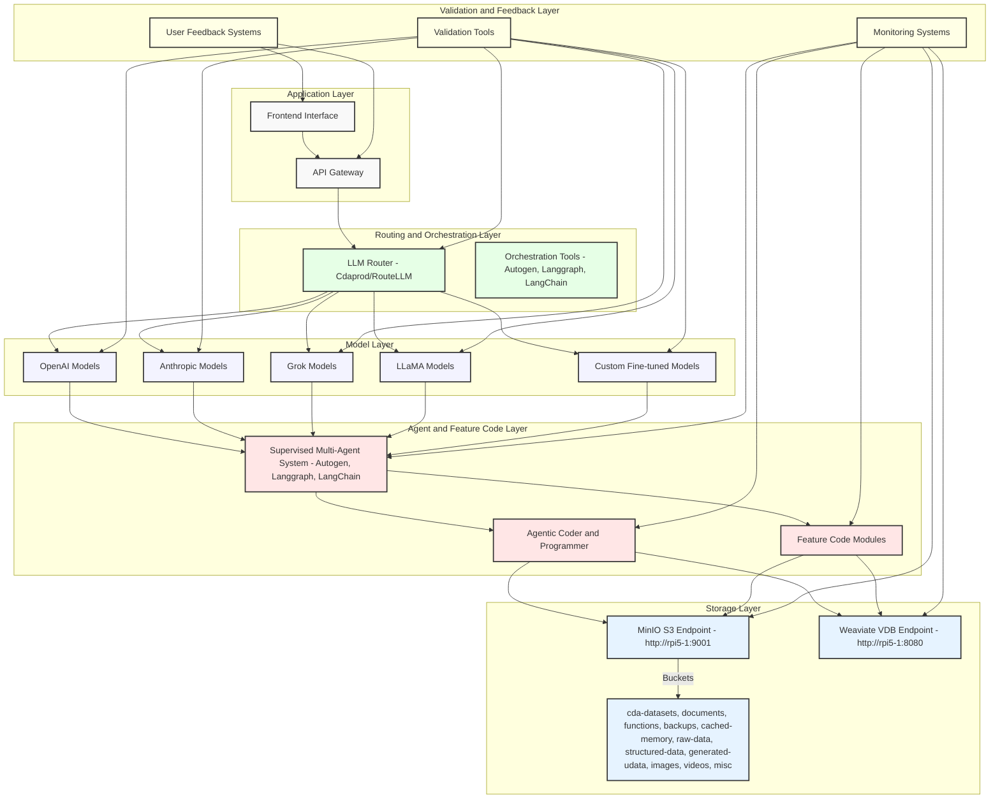
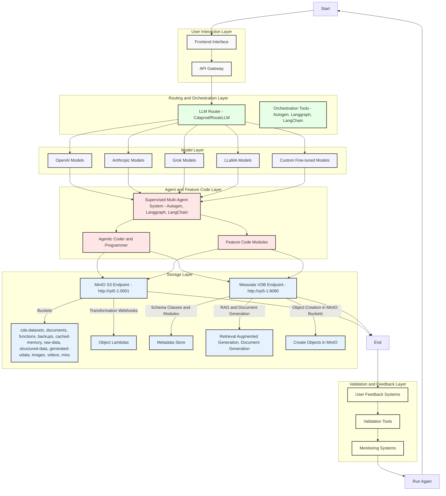

# AI Multi-Layer High-Level Architecture Diagram
###### Cdaprod/ David Cannan



#### 1. Application Layer
- **Components**:
  - **API Gateway**: Manages and routes incoming requests.
  - **Frontend Interface**: User interfaces for web and mobile apps.

#### 2. Model Layer
- **Components**:
  - **OpenAI Models**: Including GPT-4 and Codex.
  - **Anthropic Models**: Such as Claude.
  - **Grok Models**.
  - **LLaMA Models**: From Meta.
  - **Custom Fine-tuned Models**: Specific to your domain.

#### 3. Routing and Orchestration Layer
- **Components**:
  - **LLM Router (Cdaprod/RouteLLM)**: Routes requests to the appropriate language model.
  - **Orchestration Tools**: Including Autogen, Langgraph, and LangChain for managing multi-agent systems.

#### 4. Agent and Feature Code Layer
- **Components**:
  - **Supervised Multi-Agent System**: Tools like Autogen, Langgraph, and LangChain.
  - **Agentic Coder and Programmer**: Capabilities for agents to read/write to the system with user feedback.
  - **Feature Code Modules**: Scripts and programs implementing specific functionalities.

#### 5. Storage Layer
- **Components**:
  - **MinIO S3 Endpoint**: Accessible at `http://rpi5-1:9001`.
    - **Buckets**: Includes cda-datasets, documents, functions, backups, cached-memory, raw-data, structured-data, generated-udata, images, videos, and misc.
  - **Weaviate VDB Endpoint**: Accessible at `http://rpi5-1:8080`.

#### 6. Validation and Feedback Layer
- **Components**:
  - **User Feedback Systems**: Mechanisms for collecting user input and feedback.
  - **Validation Tools**: Tools and scripts for validating model outputs and system performance.
  - **Monitoring Systems**: Continuous monitoring for performance metrics and logs.

### Data Flow

The data flow between these layers is as follows:

1. **From Frontend Interface to API Gateway**: User interactions are captured by the frontend interface and routed through the API gateway.
2. **From API Gateway to LLM Router**: The API gateway directs the requests to the LLM router.
3. **From LLM Router to Model Layer**: The LLM router routes the requests to the appropriate models in the model layer.
4. **From Model Layer to Agent and Feature Code Layer**: The processed data from the models is sent to the agents and feature code modules for further processing.
5. **From Agent and Feature Code Layer to Storage Layer**: The processed data is then stored or retrieved from the MinIO or Weaviate endpoints.
6. **Feedback Loop from Validation and Feedback Layer to All Other Layers**: Continuous validation and feedback mechanisms ensure that all layers are performing optimally and are adjusted based on user feedback.

## Run Diagram



## Microsoft/GraphRAG

### Overview of GraphRAG

#### Introduction

**GraphRAG** is a project developed by Microsoft designed to enhance the capabilities of large language models (LLMs) by using knowledge graph memory structures. The aim is to extract meaningful, structured data from unstructured text, facilitating better reasoning and understanding of private data.

### Key Components

1. **Data Pipeline and Transformation Suite**: GraphRAG offers a suite of tools to transform unstructured text into structured data using the power of LLMs.

2. **Knowledge Graphs**: Utilizes knowledge graph memory structures to enhance LLM outputs, enabling models to reason more effectively about complex and narrative data.

### Features

- **Structured Data Extraction**: Transforms unstructured text into structured, meaningful data.
- **Enhanced Reasoning**: Improves the reasoning capabilities of LLMs using structured knowledge graphs.
- **Private Data Handling**: Optimized for working with private, narrative data, making it suitable for enterprise applications.

### Quickstart

To get started with GraphRAG, Microsoft provides a [Solution Accelerator](https://github.com/Azure-Samples/graphrag-accelerator) package that offers a user-friendly, end-to-end experience with Azure resources.

### Detailed Guidance

- **Repository Usage**: The repository includes methodologies for using knowledge graph memory structures to enhance LLM outputs. Note that the code provided is for demonstration purposes and is not officially supported by Microsoft.
- **Prompt Tuning**: Fine-tuning prompts is crucial for achieving optimal results with GraphRAG. Microsoft provides a [Prompt Tuning Guide](https://microsoft.github.io/graphrag/posts/prompt_tuning/overview/) for this purpose.

### Responsible AI and Limitations

- **Evaluation and Metrics**: GraphRAG has been evaluated using specific metrics to measure performance. Details are available in the [Responsible AI FAQ](./RAI_TRANSPARENCY.md).
- **Limitations**: Users are advised to understand the limitations of GraphRAG and take steps to minimize their impact when using the system.

### Trademarks and Privacy

- **Trademarks**: Use of Microsoft trademarks and logos must follow [Microsoft's Trademark & Brand Guidelines](https://www.microsoft.com/en-us/legal/intellectualproperty/trademarks/usage/general).
- **Privacy**: Microsoft’s [Privacy Statement](https://privacy.microsoft.com/en-us/privacystatement) applies to this project.

### Integrating GraphRAG into Your Architecture

To integrate GraphRAG into your architecture, consider its role in enhancing the LLMs' ability to handle and reason about private, narrative data. This can be particularly useful in scenarios requiring structured data extraction and enhanced reasoning capabilities. The project fits well into a data pipeline where structured knowledge graphs are essential for improving the accuracy and efficiency of AI-driven insights.

### Example Use Case

**Document Processing Pipeline**:
1. **Data Ingestion**: Unstructured text data is ingested into the system.
2. **Data Transformation**: GraphRAG transforms the unstructured text into structured data using LLMs and knowledge graphs.
3. **Reasoning and Analysis**: Enhanced LLMs process the structured data for reasoning and analysis.
4. **Output**: Structured insights and data are generated, which can be used for further decision-making processes.

### Conclusion

GraphRAG is a powerful tool for transforming unstructured text into meaningful, structured data using LLMs. By incorporating knowledge graph memory structures, it enhances the reasoning capabilities of LLMs, making it an essential component for advanced data processing and AI applications. For more detailed information, visit the [GraphRAG documentation](https://microsoft.github.io/graphrag) and [Microsoft Research Blog Post](https://www.microsoft.com/en-us/research/blog/graphrag-unlocking-llm-discovery-on-narrative-private-data/).

## OpenAI API Functions (generate_blog_post and analyze_web_content)

To enable your custom GPT to query your locally hosted application via an API call, you can use OpenAI's function calling capability. Here’s how to set this up, including complex scenarios for handling multiple functions and chaining function calls.

### Steps to Enable API Calls from OpenAI to Local Application

#### 1. Set Up Your Flask Application

First, ensure your Flask application with the necessary endpoints is running locally.

**Example Flask App**:
```python
from flask import Flask, request, jsonify

app = Flask(__name__)

@app.route('/generate_blog_post', methods=['POST'])
def generate_blog_post():
    query = request.json['query']
    # Generate blog post logic
    blog_post = f"Generated blog post for query: {query}"
    return jsonify({"content": blog_post})

@app.route('/analyze_web_content', methods=['POST'])
def analyze_web_content():
    url = request.json['url']
    # Analyze web content logic
    analysis = f"Analysis of web content at {url}"
    return jsonify({"content": analysis})

if __name__ == '__main__':
    app.run(host='0.0.0.0', port=5000)
```

#### 2. Define Functions in OpenAI

Next, define the custom actions that your GPT will perform by creating function definitions.

**Function Definitions**:
```python
import openai

openai.api_key = 'your_openai_api_key'

functions = [
    {
        "name": "generate_blog_post",
        "description": "Generates a blog post from a query",
        "parameters": {
            "type": "object",
            "properties": {
                "query": {"type": "string"}
            },
            "required": ["query"]
        }
    },
    {
        "name": "analyze_web_content",
        "description": "Analyzes web content and returns a markdown document",
        "parameters": {
            "type": "object",
            "properties": {
                "url": {"type": "string"}
            },
            "required": ["url"]
        }
    }
]
```

#### 3. Configure GPT in OpenAI Platform

In the OpenAI configuration interface, set up your GPT with the defined functions.

1. **Name**: Dynamic ETL Assistant
2. **Description**: This assistant integrates MinIO object store and Weaviate vector database to perform dynamic ETL operations, generate content, and analyze data based on user queries.
3. **Instructions**: This GPT performs dynamic ETL tasks by integrating MinIO and Weaviate. It should avoid executing actions without user confirmation.
4. **Conversation Starters**:
   - "How can I generate a blog post about integrating MinIO with Weaviate?"
   - "Analyze the content from the URL: https://example.com/article and store the result."
5. **Capabilities**: Enable Web Browsing, DALL-E Image Generation (if relevant), Code Interpreter & Data Analysis.

**Creating New Action**:
1. **Generate Blog Post**:
   - **API Endpoint**: http://localhost:5000/generate_blog_post
   - **HTTP Method**: POST

2. **Analyze Web Content**:
   - **API Endpoint**: http://localhost:5000/analyze_web_content
   - **HTTP Method**: POST

#### 4. Handle Function Calls in Backend

Make sure your Flask server is set up to handle these requests.

**Handling Function Calls**:
```python
@app.route('/process_function_call', methods=['POST'])
def process_function_call():
    data = request.json
    function_name = data.get('function')
    args = data.get('arguments', {})
    
    if function_name == "generate_blog_post":
        return generate_blog_post(args)
    elif function_name == "analyze_web_content":
        return analyze_web_content(args)
    else:
        return jsonify({"error": "Function not found"}), 404

if __name__ == '__main__':
    app.run(host='0.0.0.0', port=5000)
```

### Complex Function Handling

To handle more complex scenarios such as chaining function calls or handling multi-step processes, you can set up your OpenAI assistant to use a dialogue context and manage the sequence of calls effectively.

**Example**:
1. **Define a Function with Multiple Steps**:
   - Use OpenAI's `function_call` parameter to specify a sequence of operations.
   - Manage the state and context between calls by using dialogue history or context objects.

2. **Example Complex Function Call**:
   ```python
   custom_functions = [
       {
           'name': 'generate_blog_post',
           'description': 'Generates a blog post from a query',
           'parameters': {
               'type': 'object',
               'properties': {
                   'query': {'type': 'string'}
               }
           }
       },
       {
           'name': 'analyze_web_content',
           'description': 'Analyzes web content and returns a markdown document',
           'parameters': {
               'type': 'object',
               'properties': {
                   'url': {'type': 'string'}
               }
           }
       }
   ]

   response = openai.ChatCompletion.create(
       model="gpt-4-0613",
       messages=[
           {"role": "system", "content": "You are an assistant that can call functions."},
           {"role": "user", "content": "Analyze the content at https://example.com/article"}
       ],
       functions=custom_functions,
       function_call="auto"
   )
   ```

By implementing these steps, you can effectively integrate your locally hosted application with OpenAI's GPT for complex and dynamic ETL tasks. For more detailed examples and guidance, refer to resources such as the OpenAI [API documentation](https://platform.openai.com/docs/guides/prompt-engineering) and the OpenAI [Cookbook on GitHub](https://github.com/openai/openai-cookbook).

## OpenAI with MinIO and Weaviate

### Optimizing AI Architecture with GraphRAG Integration

Based on the research and documentation about GraphRAG and its capabilities, here’s how you can integrate GraphRAG into your existing AI architecture to enhance the capabilities of your MinIO object store and Weaviate vector database, allowing for more complex and dynamic ETL operations.

#### Key Concepts of GraphRAG

GraphRAG enhances traditional Retrieval-Augmented Generation (RAG) by leveraging Knowledge Graphs (KGs) to improve the retrieval and generation processes. This method combines the generative power of large language models (LLMs) with the structured, interconnected data stored in KGs, resulting in more accurate and contextually relevant responses.

**GraphRAG Workflow:**
1. **Data Indexing**: Extract entities, relationships, and key claims from text units using LLMs like GPT-4. Perform hierarchical clustering of these entities using algorithms like Leiden to create a structured knowledge graph.
2. **Data Retrieval**: When a query is received, GraphRAG retrieves the most relevant nodes and edges from the knowledge graph, leveraging the structured data to provide contextually enriched information.
3. **Reranking**: The retrieved information is reranked based on its relevance to the query before being used by the generative model to formulate responses.

**Benefits**:
- Improved query understanding by connecting disparate pieces of information.
- Enhanced ability to handle complex, holistic queries about datasets.
- Provides provenance and source grounding for generated answers, improving trustworthiness and auditability.

#### Implementing GraphRAG with MinIO and Weaviate

To integrate GraphRAG into your AI architecture, follow these steps:

1. **Setup MinIO and Weaviate**:
   - Ensure MinIO is set up for object storage and Weaviate is configured as your vector database.

2. **Create the Knowledge Graph**:
   - Use an LLM to extract entities and relationships from your data stored in MinIO. This can involve processing documents, images, and other objects to identify meaningful connections.
   - Store these entities and relationships in Weaviate, which will act as your knowledge graph.

3. **Indexing**:
   - Slice your input corpus into text units and extract relevant entities and relationships using the LLM.
   - Use hierarchical clustering to organize these entities into a knowledge graph.

4. **Query Processing**:
   - For incoming queries, use the knowledge graph to retrieve the most relevant nodes and edges.
   - Leverage this structured data to provide contextually rich responses.

5. **Integration with OpenAI**:
   - Use OpenAI’s API to define and handle functions for querying your local application. This can involve creating endpoints in your Flask application to generate blog posts, analyze web content, and interact with your knowledge graph.

**Example Function Definitions**:
```python
functions = [
    {
        "name": "generate_blog_post",
        "description": "Generates a blog post from a query",
        "parameters": {
            "type": "object",
            "properties": {
                "query": {"type": "string"}
            },
            "required": ["query"]
        }
    },
    {
        "name": "analyze_web_content",
        "description": "Analyzes web content and returns a markdown document",
        "parameters": {
            "type": "object",
            "properties": {
                "url": {"type": "string"}
            },
            "required": ["url"]
        }
    }
]
```

**Handling Function Calls**:
Ensure your Flask server is configured to process these function calls:
```python
@app.route('/process_function_call', methods=['POST'])
def process_function_call():
    data = request.json
    function_name = data.get('function')
    args = data.get('arguments', {})
    
    if function_name == "generate_blog_post":
        return generate_blog_post(args)
    elif function_name == "analyze_web_content":
        return analyze_web_content(args)
    else:
        return jsonify({"error": "Function not found"}), 404

if __name__ == '__main__':
    app.run(host='0.0.0.0', port=5000)
```

#### Leveraging GraphRAG in Queries

By integrating GraphRAG, you enable your AI system to perform complex data retrieval and generation tasks with greater accuracy and contextual understanding. For instance, generating a comprehensive blog post about MinIO and Weaviate integration can involve retrieving and synthesizing related content stored across various entities and relationships in your knowledge graph.

### References:
- [Microsoft GraphRAG Documentation](https://microsoft.github.io/graphrag/)
- [GraphRAG Research Paper](https://arxiv.org/pdf/2404.16130)
- [GraphRAG Implementation Guide](https://pingcap.com/blog/GraphRAG)

These resources provide detailed information on setting up and optimizing GraphRAG within your AI architecture. By following these guidelines, you can enhance the capabilities of your MinIO and Weaviate integration, enabling more sophisticated and effective data processing and querying functionalities.

## Per Bucket Listed Objects (Retrieve Entities)

To create an advanced implementation where MinIO bucket objects are listed and can be input either individually or as a collection for modeling and querying, you will need to integrate the functionalities of MinIO, Weaviate, and GraphRAG. This setup will enable dynamic and sophisticated data management and retrieval.

### Advanced Setup Steps

1. **List MinIO Bucket Objects**: Use the MinIO Python SDK to list objects in a specified bucket.

2. **Model Objects**: Each object in MinIO can be processed individually or collectively to extract entities and relationships, which will be stored in Weaviate.

3. **Integrate with GraphRAG**: Use GraphRAG to enhance the RAG capabilities by processing queries, extracting relevant information, and providing enriched responses.

4. **Implement OpenAI Function Calling**: Enable querying capabilities using OpenAI's API to interact with the system dynamically.

#### 1. List MinIO Bucket Objects

```python
from minio import Minio

# Initialize the MinIO client
minio_client = Minio(
    "localhost:9001",
    access_key="minioadmin",
    secret_key="minioadmin",
    secure=False
)

# Function to list objects in a bucket
def list_objects(bucket_name):
    objects = minio_client.list_objects(bucket_name)
    return [obj.object_name for obj in objects]

# Example usage
bucket_name = "documents"
object_list = list_objects(bucket_name)
print(object_list)
```

#### 2. Process and Model Objects

For each object listed, extract and store entities and relationships in Weaviate.

```python
import weaviate
import json

# Initialize Weaviate client
weaviate_client = weaviate.Client("http://localhost:8080")

# Define schema for entities
def create_schema():
    class_obj = {
        "class": "Entity",
        "description": "An entity extracted from documents",
        "properties": [
            {"name": "name", "dataType": ["string"]},
            {"name": "description", "dataType": ["text"]},
            {"name": "vector", "dataType": ["number[]"]}
        ]
    }
    weaviate_client.schema.create_class(class_obj)

# Extract entities from object content
def extract_entities(object_content):
    # Use an NLP model (e.g., OpenAI GPT-4) to extract entities
    # This is a placeholder for actual entity extraction logic
    entities = [
        {"name": "Elon Musk", "description": "CEO of SpaceX", "vector": [0.1, 0.2, 0.3]}
    ]
    return entities

# Store entities in Weaviate
def store_entities(entities):
    for entity in entities:
        weaviate_client.data_object.create(entity, "Entity")

# Example processing function
def process_objects(bucket_name):
    object_list = list_objects(bucket_name)
    for object_name in object_list:
        object_content = minio_client.get_object(bucket_name, object_name).read().decode("utf-8")
        entities = extract_entities(object_content)
        store_entities(entities)

# Create schema and process objects
create_schema()
process_objects("documents")
```

#### 3. Integrate GraphRAG

Configure GraphRAG to use the extracted entities and relationships for enhanced querying.

```bash
python -m graphrag.index --init --root ./ragtest
```

Modify `settings.yaml` to include necessary configurations for GraphRAG to interact with Weaviate and MinIO.

#### 4. Implement OpenAI Function Calling

Define and handle functions for querying the system using OpenAI’s API.

**Function Definitions**:
```python
import openai

openai.api_key = 'your_openai_api_key'

functions = [
    {
        "name": "retrieve_entities",
        "description": "Retrieve entities based on a query",
        "parameters": {
            "type": "object",
            "properties": {
                "query": {"type": "string"}
            },
            "required": ["query"]
        }
    }
]

response = openai.ChatCompletion.create(
    model="gpt-4-0613",
    messages=[
        {"role": "system", "content": "You are an assistant that can call functions."},
        {"role": "user", "content": "Retrieve entities related to space exploration."}
    ],
    functions=functions,
    function_call="auto"
)

print(response)
```

**Handling Function Calls**:
```python
@app.route('/process_function_call', methods=['POST'])
def process_function_call():
    data = request.json
    function_name = data.get('function')
    args = data.get('arguments', {})
    
    if function_name == "retrieve_entities":
        return retrieve_entities(args['query'])
    else:
        return jsonify({"error": "Function not found"}), 404

def retrieve_entities(query):
    # Logic to query Weaviate for entities related to the query
    results = weaviate_client.query.get("Entity").with_where({
        "path": ["description"],
        "operator": "Equal",
        "valueText": query
    }).do()
    return jsonify(results)

if __name__ == '__main__':
    app.run(host='0.0.0.0', port=5000)
```

### References and Further Reading

- [MinIO Python SDK Documentation](https://docs.min.io/docs/python-client-api-reference.html)
- [Weaviate Python Client Documentation](https://weaviate.io/developers/weaviate/current/client-libraries/python.html)
- [GraphRAG Documentation](https://microsoft.github.io/graphrag/)
- [OpenAI Function Calling Documentation](https://platform.openai.com/docs/guides/completions/function-calling)

By integrating these components, you can create a powerful, flexible system that leverages the strengths of MinIO, Weaviate, and GraphRAG to handle complex queries and provide enriched, contextually relevant responses.

## Advanced Weaviate and MinIO Retrieval

To integrate your MinIO object store and Weaviate vector store with a dynamic ETL process and incorporate document generation capabilities using agents, here's a detailed approach:

### 1. Set Up the Framework

#### MinIO and Weaviate Integration
1. **MinIO SDK**: Use the MinIO Python SDK to interact with your MinIO buckets. This SDK will help you list objects, read data, and manage bucket operations.
2. **Weaviate Client**: Use the Weaviate Python client to interact with your Weaviate instance. This client will help you store, retrieve, and manage vectorized documents.

### 2. Loading and Preparing Data
Create a function to list objects in a MinIO bucket and load them into the ETL pipeline.

```python
from minio import Minio
from weaviate import Client as WeaviateClient

# Initialize MinIO client
minio_client = Minio('http://rpi5-1:9001', access_key='YOUR_ACCESS_KEY', secret_key='YOUR_SECRET_KEY', secure=False)

# List objects in a bucket
objects = minio_client.list_objects('cda-datasets')

# Initialize Weaviate client
weaviate_client = WeaviateClient("http://rpi5-1:8080")

def load_objects_from_minio(bucket_name):
    objects = minio_client.list_objects(bucket_name)
    data = []
    for obj in objects:
        response = minio_client.get_object(bucket_name, obj.object_name)
        data.append(response.read())
    return data

documents = load_objects_from_minio('cda-datasets')
```

### 3. Processing Data with GraphRAG
Use GraphRAG to process these documents, transforming them into a format suitable for further analysis and integration with LLMs.

#### Indexing and Processing Documents

```python
import os
from graph_rag import GraphRAG

# Save documents to a temporary directory
temp_dir = './temp_docs'
os.makedirs(temp_dir, exist_ok=True)

for idx, doc in enumerate(documents):
    with open(os.path.join(temp_dir, f'doc_{idx}.txt'), 'wb') as file:
        file.write(doc)

# Initialize GraphRAG
graphrag = GraphRAG()
graphrag.index_documents(temp_dir)
```

### 4. Document Generation with Agents
Create an agent to generate documents based on queries. The agent will use the indexed data and the knowledge base in Weaviate.

#### Agent Configuration and Query Handling

```python
from openai import OpenAI
from langchain import PromptTemplate, LLMChain

# Initialize OpenAI client
openai_client = OpenAI(api_key='YOUR_API_KEY')

# Define a prompt template
template = "Generate a detailed report based on the following query and data sources:\nQuery: {query}\nSources: {sources}"

prompt = PromptTemplate(template=template, input_variables=['query', 'sources'])

# Define a function to query Weaviate
def query_weaviate(query):
    results = weaviate_client.query.get('Document', ['text', 'source']).with_filter({
        "path": ["text"],
        "operator": "Like",
        "valueText": query
    }).do()
    return results['data']['Get']['Document']

# Generate a document
def generate_document(query):
    sources = query_weaviate(query)
    source_texts = "\n".join([source['text'] for source in sources])
    llm_chain = LLMChain(llm=openai_client, prompt=prompt)
    document = llm_chain.run(query=query, sources=source_texts)
    return document

# Example query
query = "What are the latest trends in AI?"
document = generate_document(query)
print(document)
```

### 5. Advanced Querying and Data Management
Enhance your document generation by integrating dynamic queries and retaining sources for context.

#### Retain Context and Sources

```python
def generate_detailed_report(query):
    sources = query_weaviate(query)
    source_texts = "\n".join([f"{source['text']} (Source: {source['source']})" for source in sources])
    llm_chain = LLMChain(llm=openai_client, prompt=prompt)
    document = llm_chain.run(query=query, sources=source_texts)
    return document

# Generate a detailed report
report = generate_detailed_report("What are the impacts of AI in healthcare?")
print(report)
```

### Conclusion
This setup enables you to dynamically integrate your MinIO and Weaviate storage layers, leveraging agents and GraphRAG for document generation. This architecture supports the creation of detailed, context-rich documents by querying both internal and external data sources.

### References
1. [GraphRAG Repository](https://github.com/microsoft/graphrag)
2. [LangChain Documentation](https://towardsai.net/p/machine-learning/langchain-develop-llm-powered-applications-using-langchain)
3. [RAG Overview](https://www.datastax.com/blog/retrieval-augmented-generation-rag)

By following this approach, you can build a robust system for generating documents that incorporate both stored knowledge and real-time data from the web.