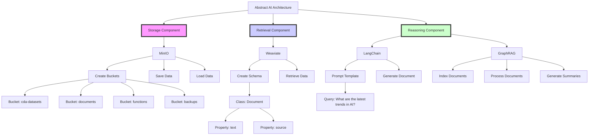
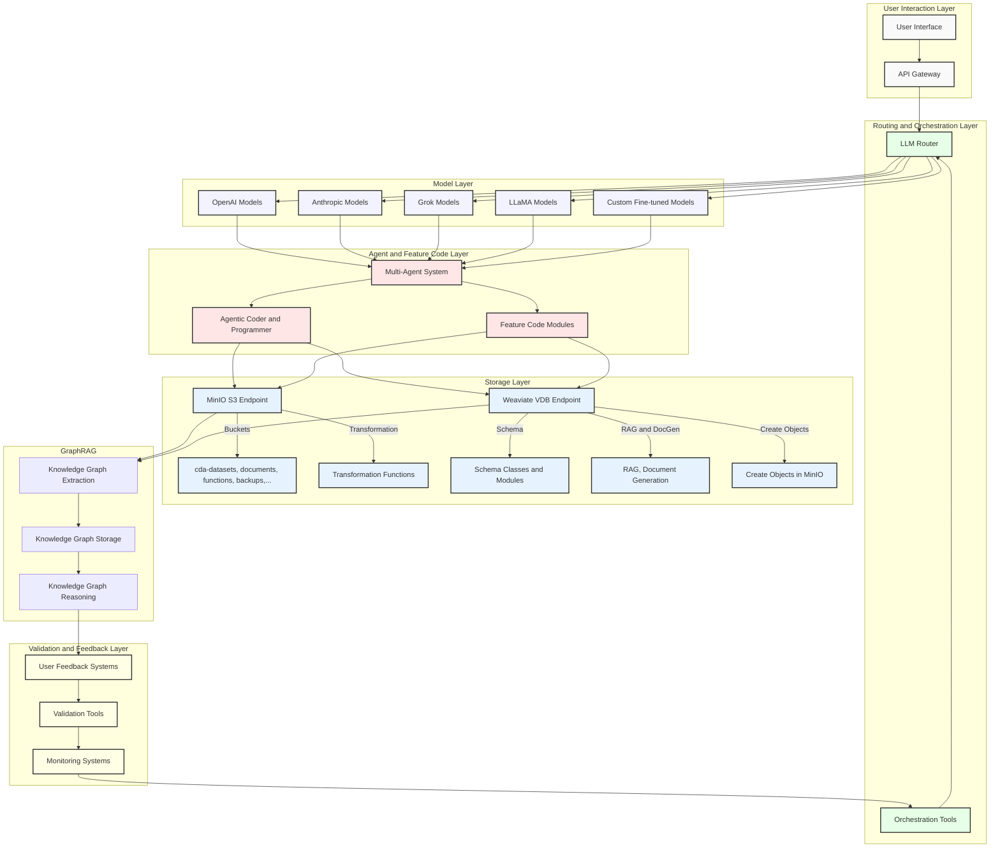
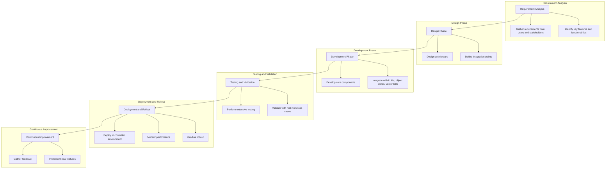

# AI Orchestration Layer

The AI Orchestration Layer is a comprehensive solution for integrating various components like Large Language Models (LLMs), AI tools, object stores, and vector databases into a seamless and unified orchestration and management layer. This repository provides tools to streamline the development, deployment, and scaling of AI applications.

## See Blog Article "Architecting AI: Storage, Retrieval, and Reasoning" for Conceptual Explanation

[Blog Article: "Architecting AI: Storage, Retrieval, and Reasoning"](/Architecting AI: Storage, Retrieval, and Reasoning.md)

### Architecting AI: Storage, Retrieval, and Reasoning

This is a detailed Mermaid diagram representing the abstracted AI architecture using MinIO for storage, Weaviate for retrieval, and a reasoning engine with LangChain and GraphRAG:

This diagram visually represents the key components and their interactions within the AI architecture discussed throughout the article:

- **Storage Component**:
  - MinIO is used for object storage.
  - Buckets are created for organizing data.
  - Functions for saving and loading data are implemented.

- **Retrieval Component**:
  - Weaviate is used for vector-based search.
  - A schema is created to manage documents.
  - Functions for data retrieval are implemented.

- **Reasoning Component**:
  - LangChain is used for prompt engineering.
  - GraphRAG is used for enhanced retrieval-augmented generation.
  - Functions for indexing, processing, and summarizing documents are implemented.

## See High-Level Documentation for the Imtegration, Processes, and Functionality

[High Level Architecture](/High-Level-Architecture.md) and [Abstract Layer](/Abstract-Layer.md) 

### High Level Diagram

This architecture unifies the components and concepts discussed in the provided sections:

1. **User Interaction Layer**: Includes the user interface and API gateway for handling user requests.

2. **Routing and Orchestration Layer**: Consists of the LLM router (e.g., RouteLLM) and orchestration tools (e.g., Autogen, Langgraph, LangChain) for directing requests to appropriate models and managing the multi-agent system.

3. **Model Layer**: Contains various language models from OpenAI, Anthropic, Grok, LLaMA, and custom fine-tuned models.

4. **Agent and Feature Code Layer**: Includes the multi-agent system, agentic coder and programmer, and feature code modules for executing tasks and generating code.

5. **Storage Layer**: Consists of MinIO for object storage (with buckets for datasets, documents, functions, backups, etc.) and Weaviate for the vector database (with schema classes, modules, RAG, document generation, and object creation in MinIO).

6. **GraphRAG Integration (can be any)**: Incorporates GraphRAG for knowledge graph extraction, storage, and reasoning, enhancing the retrieval and generation capabilities.

7. **Validation and Feedback Layer**: Includes user feedback systems, validation tools, and monitoring systems for ensuring the quality and performance of the system.

The data flow follows the arrows, starting from user interactions and moving through the layers for processing, storage, and feedback.

This architecture provides a comprehensive and scalable solution for integrating various AI components, including MinIO, Weaviate, and GraphRAG, to enable dynamic ETL operations, document generation, and advanced querying capabilities.​​​​​​​​​​​​​​​​

## Understanding Production Level Implementation Diagram as Road Map

## Features

### Integrated Development Environment (IDE)
- **Description**: An AI-focused IDE that integrates with popular tools like LangChain, LangGraph, and Autogen, facilitating seamless development, testing, and deployment.
- **Benefits**: Simplifies the development process, making it easier to create, debug, and deploy AI applications.

### Resource Management
- **Description**: A centralized dashboard for managing compute resources, including local and cloud-hosted LLMs, GPU clusters, and storage solutions.
- **Benefits**: Optimizes resource allocation and simplifies scaling, reducing the complexity of managing heterogeneous environments.

### Data Management and Integration
- **Description**: A unified interface for managing data across MinIO (object storage) and Weaviate (vector database), with built-in ETL pipelines.
- **Benefits**: Ensures smooth data flow and synchronization between storage and AI models, facilitating better data management and utilization.

### Pipeline Orchestration
- **Description**: Tools for designing and managing AI pipelines, integrating components like data preprocessing, model training, inference, and post-processing.
- **Benefits**: Simplifies the creation and maintenance of end-to-end AI workflows, improving productivity and reducing errors.

### Monitoring and Logging
- **Description**: Comprehensive monitoring and logging capabilities for tracking the performance and usage of AI models, data storage, and computational resources.
- **Benefits**: Enhances observability, helping developers to identify and resolve issues quickly, and ensuring optimal performance.

### Security and Compliance
- **Description**: Built-in security features like access controls, encryption, and compliance monitoring, integrated across all components.
- **Benefits**: Ensures data privacy and regulatory compliance, providing peace of mind for developers and organizations.

### Version Control and Collaboration
- **Description**: Integration with version control systems (e.g., GitHub) and collaboration tools (e.g., Slack, Teams) to support collaborative development and versioning of code, models, and datasets.
- **Benefits**: Facilitates team collaboration and ensures reproducibility and traceability of AI projects.

### Automated Deployment and Scaling
- **Description**: Automation tools for deploying and scaling AI models and applications, both on-premises and in the cloud.
- **Benefits**: Reduces the operational overhead and complexity associated with deploying AI solutions at scale.

### User-friendly Interface
- **Description**: An intuitive user interface that abstracts the complexities of the underlying infrastructure, making it accessible to developers with varying levels of expertise.
- **Benefits**: Lowers the barrier to entry for AI development, enabling a broader range of developers to contribute.

## Roadmap

### Requirement Analysis
- **Tasks**:
  1. Gather requirements from potential users and stakeholders.
  2. Identify key features and functionalities based on user needs.

### Design Phase
- **Tasks**:
  1. Design the architecture of the orchestration layer, ensuring modularity and scalability.
  2. Define integration points with existing tools and frameworks.

### Development Phase
- **Tasks**:
  1. Develop the core components of the orchestration layer, starting with critical features like resource management and pipeline orchestration.
  2. Implement integration with popular LLMs, object stores, and vector databases.

### Testing and Validation
- **Tasks**:
  1. Perform extensive testing to ensure reliability and performance.
  2. Validate the system with real-world use cases and gather feedback for improvements.

### Deployment and Rollout
- **Tasks**:
  1. Deploy the orchestration layer in a controlled environment and monitor its performance.
  2. Gradually roll out to a wider audience, providing support and updates as needed.

### Continuous Improvement
- **Tasks**:
  1. Continuously gather feedback from users and stakeholders.
  2. Implement new features and improvements based on evolving needs and technologies.

## References
- [The State of AI Infrastructure at Scale 2024](https://ai-infrastructure.org/wp-content/uploads/2024/03/The-State-of-AI-Infrastructure-at-Scale-2024.pdf)
- [New infrastructure for the era of AI: Emerging technology and trends in 2024](https://azure.microsoft.com/en-us/blog/new-infrastructure-for-the-era-of-ai-emerging-technology-and-trends-in-2024/)
- [The most important AI trends in 2024 - IBM Blog](https://www.ibm.com/blog/the-most-important-ai-trends-in-2024)

## Contributing
We welcome contributions from the community. Please read our [Contributing Guidelines](CONTRIBUTING.md) for more details.

MIT 2024 By David Cannan Cdaprod
