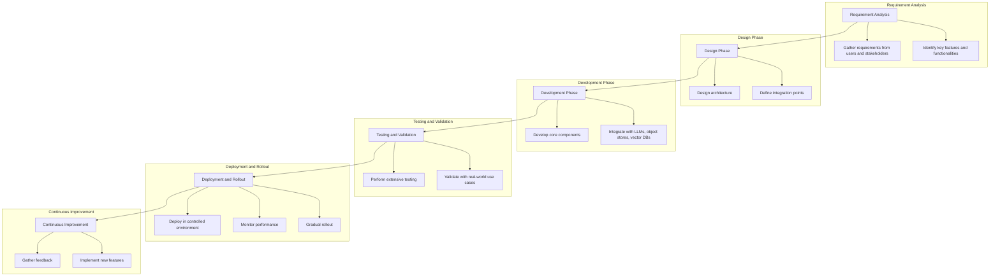

# AI Orchestration Layer

The AI Orchestration Layer is a comprehensive solution for integrating various components like Large Language Models (LLMs), AI tools, object stores, and vector databases into a seamless and unified orchestration and management layer. This repository provides tools to streamline the development, deployment, and scaling of AI applications.

## Features

### Integrated Development Environment (IDE)
- **Description**: An AI-focused IDE that integrates with popular tools like LangChain, LangGraph, and Autogen, facilitating seamless development, testing, and deployment.
- **Benefits**: Simplifies the development process, making it easier to create, debug, and deploy AI applications.

### Resource Management
- **Description**: A centralized dashboard for managing compute resources, including local and cloud-hosted LLMs, GPU clusters, and storage solutions.
- **Benefits**: Optimizes resource allocation and simplifies scaling, reducing the complexity of managing heterogeneous environments.

### Data Management and Integration
- **Description**: A unified interface for managing data across MinIO (object storage) and Weaviate (vector database), with built-in ETL pipelines.
- **Benefits**: Ensures smooth data flow and synchronization between storage and AI models, facilitating better data management and utilization.

### Pipeline Orchestration
- **Description**: Tools for designing and managing AI pipelines, integrating components like data preprocessing, model training, inference, and post-processing.
- **Benefits**: Simplifies the creation and maintenance of end-to-end AI workflows, improving productivity and reducing errors.

### Monitoring and Logging
- **Description**: Comprehensive monitoring and logging capabilities for tracking the performance and usage of AI models, data storage, and computational resources.
- **Benefits**: Enhances observability, helping developers to identify and resolve issues quickly, and ensuring optimal performance.

### Security and Compliance
- **Description**: Built-in security features like access controls, encryption, and compliance monitoring, integrated across all components.
- **Benefits**: Ensures data privacy and regulatory compliance, providing peace of mind for developers and organizations.

### Version Control and Collaboration
- **Description**: Integration with version control systems (e.g., GitHub) and collaboration tools (e.g., Slack, Teams) to support collaborative development and versioning of code, models, and datasets.
- **Benefits**: Facilitates team collaboration and ensures reproducibility and traceability of AI projects.

### Automated Deployment and Scaling
- **Description**: Automation tools for deploying and scaling AI models and applications, both on-premises and in the cloud.
- **Benefits**: Reduces the operational overhead and complexity associated with deploying AI solutions at scale.

### User-friendly Interface
- **Description**: An intuitive user interface that abstracts the complexities of the underlying infrastructure, making it accessible to developers with varying levels of expertise.
- **Benefits**: Lowers the barrier to entry for AI development, enabling a broader range of developers to contribute.

## Roadmap

### Requirement Analysis
- **Tasks**:
  1. Gather requirements from potential users and stakeholders.
  2. Identify key features and functionalities based on user needs.

### Design Phase
- **Tasks**:
  1. Design the architecture of the orchestration layer, ensuring modularity and scalability.
  2. Define integration points with existing tools and frameworks.

### Development Phase
- **Tasks**:
  1. Develop the core components of the orchestration layer, starting with critical features like resource management and pipeline orchestration.
  2. Implement integration with popular LLMs, object stores, and vector databases.

### Testing and Validation
- **Tasks**:
  1. Perform extensive testing to ensure reliability and performance.
  2. Validate the system with real-world use cases and gather feedback for improvements.

### Deployment and Rollout
- **Tasks**:
  1. Deploy the orchestration layer in a controlled environment and monitor its performance.
  2. Gradually roll out to a wider audience, providing support and updates as needed.

### Continuous Improvement
- **Tasks**:
  1. Continuously gather feedback from users and stakeholders.
  2. Implement new features and improvements based on evolving needs and technologies.

## References
- [The State of AI Infrastructure at Scale 2024](https://ai-infrastructure.org/wp-content/uploads/2024/03/The-State-of-AI-Infrastructure-at-Scale-2024.pdf)
- [New infrastructure for the era of AI: Emerging technology and trends in 2024](https://azure.microsoft.com/en-us/blog/new-infrastructure-for-the-era-of-ai-emerging-technology-and-trends-in-2024/)
- [The most important AI trends in 2024 - IBM Blog](https://www.ibm.com/blog/the-most-important-ai-trends-in-2024)

## Contributing
We welcome contributions from the community. Please read our [Contributing Guidelines](CONTRIBUTING.md) for more details.

MIT 2024 By David Cannan Cdaprod